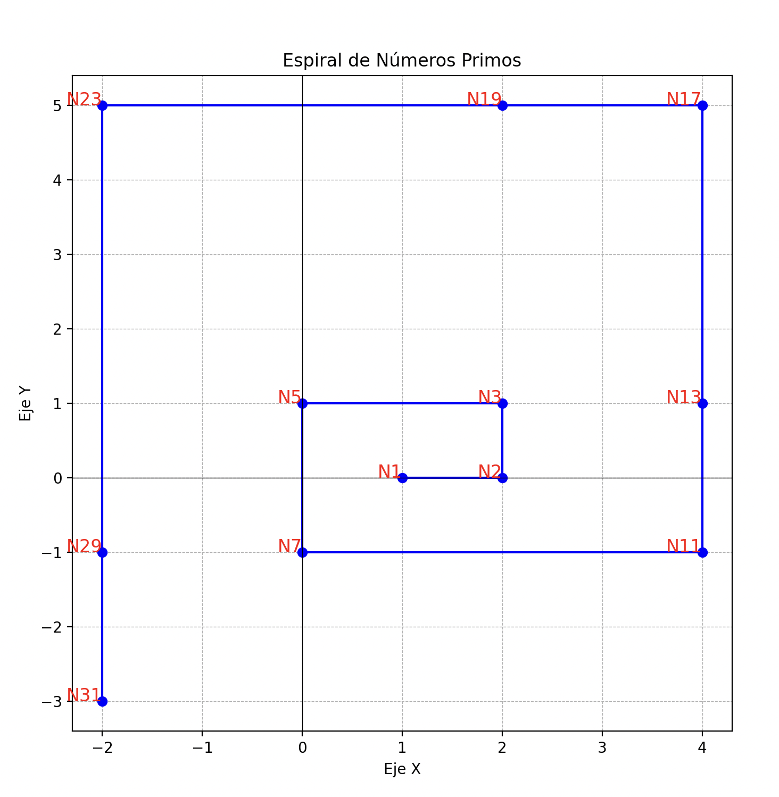

# Grafica en python

1. ¿Qué regularidades encuentra en la construcción de esta espiral gráfica de los números primos?
1) La espiral se construye siguiendo un patrón en el que los números primos se ubican en posiciones específicas conforme avanzamos en un trayecto con giros de 90°.
Los desplazamientos entre puntos aumentan en ciertos momentos (por ejemplo, al pasar de N7 a N11, se incrementa el recorrido en 4 unidades en lugar de

2) Se observa que los números primos tienden a distribuirse de manera dispersa, lo que sugiere que no siguen una secuencia aritmética simple en la espiral.

2. ¿Puede observar si existe una singularidad? Si es el caso, describa el patrón que existe.

Una singularidad importante es que no todos los números primos encajan perfectamente en el patrón de giro de 90°. Esto ocurre, por ejemplo, con los puntos N17 y N23, donde en lugar de girar, se continúa avanzando en la misma dirección para evitar el cruce con puntos anteriores.
Otro patrón interesante es que los números primos parecen formar segmentos de líneas casi rectas dentro de la espiral antes de cada giro, lo que sugiere cierta alineación estructural en su disposición.

No se observa una repetición cíclica exacta en la ubicación de los números primos dentro de la espiral, lo que refuerza la naturaleza impredecible de su distribución.

